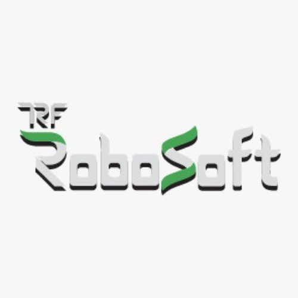
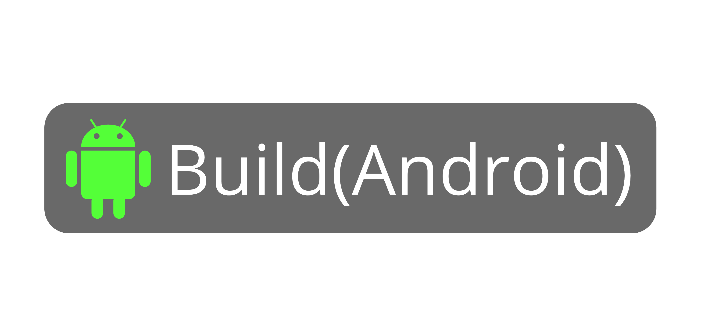
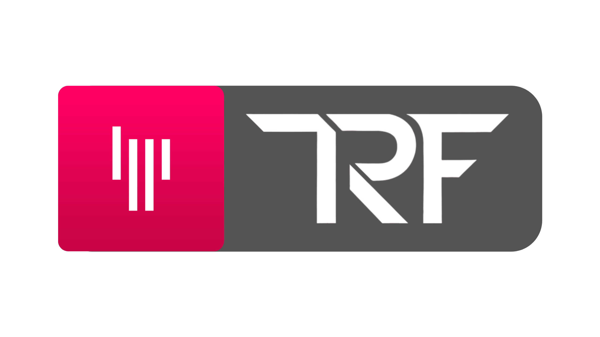

<div>
  <p>
    
    
  </p>
</div>
<br><br><br><br><br><br><br><br><br>


<p align="center">

</p>
<p align="center">
<h3>Android App | TRF Level 1 Workshop</h3>
<h4>Netra is the Android Application that TRF uses for Level 1 Workshop.</h4>
</p>




Download on your device and have a quick look at [Netra](https://vitpunerobotics.com/cms1/download_apk.php).


## Features

Please check out the in-development features of the app. by enabling the Developer mode from the settings menu.

|   *Image*       |   *Feature*          | *Description*                               | *Current Status*         |
|-------------------|------------------------|-----------------------------|--------------------|
|   |  Face Follower  | In this feature, the mobile device is embedded on the bot and the device tracks the user’s face to follow him/her according to movements. Commands are sent to bot via Bluetooth using standard conventions.      | Enchancement Phase |
|     |  Manual Control  | Joystick with predefined button left, right, forward, backward and circular joystick along with  terminal to send diverse commands.   | In Progress |
|     |  [OCR](https://en.wikipedia.org/wiki/Optical_character_recognition) + Distance  | The mobile device is embedded on the bot and it continuously scan for the character on detecting character L(left), R(right), F(forward), B(backward) it sends a command to the bot using standard convention. BUT the command should be sent only if the character is at a particular distance. | In Progress |
|     |  Voice Control | On a specific keyword let say "TRF" the voice command should get activated and depending upon inputs from the user command should be sent to bot via Bluetooth.| Development Phase |

## Want to Contribute 🙋‍♂️?

Awesome! If you want to contribute to this project, you're always welcome! See [Contributing Guidelines](CONTRIBUTING.md). You can also take a look at [Netra's Project Status Tracker](https://github.com/The-Robotics-Forum/netra/issues) for getting more information about current or upcoming tasks.

## Report issues

Something not working properly OR feature that not have been implemented yet.Check the issue tracker and add a new one if your problem is not listed. Please provide a detailed description of your problem and include steps to reproduce it.


## Want to discuss? 💬

Have any questions, doubts or want to present your opinions, views? You're always welcome. You can [start discussions](https://gitter.im/The-Robotics-Forum/netra).


## Contributors

- [Chinmay Kulkarni](https://github.com/Grandolf49)
- [Tarun Medtiya](https://github.com/tarun42)
- [Avinash Vijayvargiya](https://github.com/avinash14022002)


## License

```
MIT License

Copyright (c) 2020 The Robotics Forum, VIT Pune

Permission is hereby granted, free of charge, to any person obtaining a copy
of this software and associated documentation files (the "Software"), to deal
in the Software without restriction, including without limitation the rights
to use, copy, modify, merge, publish, distribute, sublicense, and/or sell
copies of the Software, and to permit persons to whom the Software is
furnished to do so, subject to the following conditions:

The above copyright notice and this permission notice shall be included in all
copies or substantial portions of the Software.

THE SOFTWARE IS PROVIDED "AS IS", WITHOUT WARRANTY OF ANY KIND, EXPRESS OR
IMPLIED, INCLUDING BUT NOT LIMITED TO THE WARRANTIES OF MERCHANTABILITY,
FITNESS FOR A PARTICULAR PURPOSE AND NONINFRINGEMENT. IN NO EVENT SHALL THE
AUTHORS OR COPYRIGHT HOLDERS BE LIABLE FOR ANY CLAIM, DAMAGES OR OTHER
LIABILITY, WHETHER IN AN ACTION OF CONTRACT, TORT OR OTHERWISE, ARISING FROM,
OUT OF OR IN CONNECTION WITH THE SOFTWARE OR THE USE OR OTHER DEALINGS IN THE
SOFTWARE.
```
